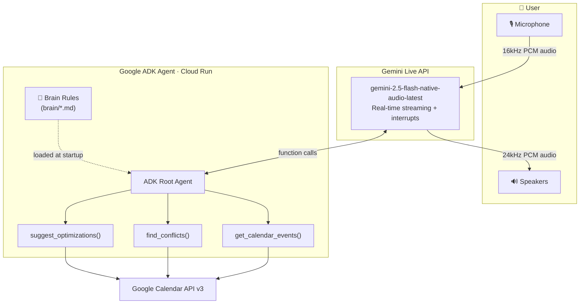
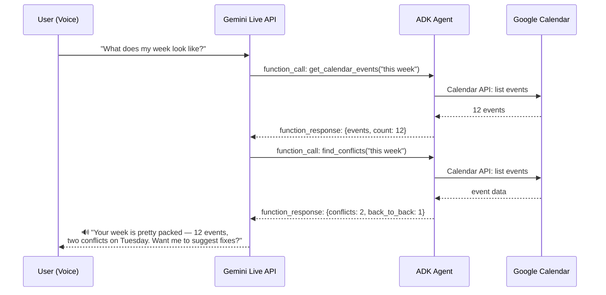

# Voice Schedule Analyst

> **Gemini Live Agent Challenge 2026** — Category: Live Agents
>
> A voice-first calendar analyst that you can *talk to* about your schedule.
> It speaks back conflicts, optimization suggestions, and answers — not text, not lists, natural speech.

## The Problem

Calendar management is a visual task trapped in visual tools. You can't check your schedule while driving, cooking, or walking between meetings. When conflicts pile up, you don't need another notification — you need someone who *understands* your priorities and tells you what to do about it.

## The Solution

Voice Schedule Analyst is a **Gemini Live API agent** that acts like a chief of staff for your calendar. Talk to it naturally:

- *"What does my week look like?"* → Speaks a concise schedule overview
- *"Any conflicts I should worry about?"* → Identifies overlaps, back-to-back fatigue, dead-time gaps
- *"How can I get more deep work time?"* → Suggests specific moves based on your priority rules
- *"Am I free Thursday afternoon?"* → Checks and responds conversationally

It uses **configurable brain rules** — human-readable markdown files that define your priorities (protected blocks, family-first, energy windows). Change the rules, change the agent's behavior. No code changes needed.

## Architecture



### Voice Interaction Flow



## Tech Stack

| Component | Technology |
|-----------|-----------|
| **Agent Framework** | [Google Agent Development Kit (ADK)](https://google.github.io/adk-docs/) |
| **Voice Interface** | Gemini Live API (`gemini-2.5-flash-native-audio-latest`) |
| **Calendar Data** | Google Calendar API v3 |
| **Deployment** | Google Cloud Run (Docker, one-command deploy) |
| **Language** | Python 3.12+ |
| **Audio I/O** | PyAudio (16kHz input, 24kHz output, mono PCM) |

## Quick Start

### Prerequisites

- Python 3.12+
- Google Cloud project with Calendar API enabled
- `GOOGLE_API_KEY` — get one at [AI Studio](https://aistudio.google.com/app/apikey)
- OAuth client credentials (`credentials.json`) — from [Cloud Console](https://console.cloud.google.com/apis/credentials)
- PortAudio (for voice mode): `brew install portaudio` (macOS) / `apt install portaudio19-dev` (Linux)

### Setup

```bash
# Clone
git clone https://github.com/jkosturko/voice-schedule-analyst.git
cd voice-schedule-analyst

# Create virtual environment
python -m venv .venv && source .venv/bin/activate

# Install dependencies
pip install -r requirements.txt
pip install pyaudio  # Optional: only needed for voice mode

# Configure
cp .env.example .env
# Edit .env — add your GOOGLE_API_KEY

# Authorize Google Calendar (one-time — opens browser)
python -m schedule_analyst.auth
```

### Run

```bash
# Voice mode — talk to the agent through your mic, hear responses through speakers
python -m schedule_analyst voice

# Text mode — type questions, get text responses (no audio hardware needed)
python -m schedule_analyst text

# Demo mode — scripted queries for recording competition video
python -m schedule_analyst demo

# ADK web UI — interactive development and testing
adk web schedule_analyst

# HTTP server — REST API for Cloud Run / webhook integration
python main.py
```

### Deploy to Cloud Run

```bash
export GOOGLE_CLOUD_PROJECT=your-project-id

# One-command deploy (enables APIs, builds, deploys)
./scripts/deploy.sh $GOOGLE_CLOUD_PROJECT us-east1
```

## Three Tools

| Tool | Purpose | When it's called |
|------|---------|-----------------|
| `get_calendar_events()` | Fetch events for a time range | "What's on my calendar today?" |
| `find_conflicts()` | Detect overlaps, back-to-back chains, dead time | "Any scheduling problems this week?" |
| `suggest_optimizations()` | Recommend moves, shifts, blocks based on brain rules | "How can I protect my deep work time?" |

## Brain Rules

The agent's analysis preferences live in [`brain/schedule-analysis-rules.md`](brain/schedule-analysis-rules.md) — human-readable, version-controlled, no code changes needed:

| Rule | Behavior |
|------|----------|
| **Protected events** | Deep Work, Focus Time, Creative Block, Family — never suggests removing |
| **Conflict severity** | Triple-booking = critical, double-booking = warning |
| **Travel buffer** | 1.5 hours before departure events |
| **Meeting fatigue** | 3+ consecutive meetings triggers warning |
| **Dead time** | Gaps under 30 minutes between meetings flagged |
| **Energy windows** | 10am-12pm protected for deep work (optimization focus) |
| **Priority order** | Family > protected blocks > scheduled meetings > moveable events |

Edit the brain file to match your preferences. The agent loads it at startup.

## API Endpoints

For HTTP/webhook integration (Cloud Run):

| Endpoint | Method | Description |
|----------|--------|-------------|
| `/health` | GET | Health check — returns agent status |
| `/schedule-analyst/analyze` | POST | Full schedule analysis with conflicts |
| `/schedule-analyst/optimize` | POST | Optimization suggestions for a focus area |
| `/schedule-analyst/question` | POST | Natural language schedule question |

```bash
# Example: analyze this week
curl -X POST http://localhost:8080/schedule-analyst/analyze \
  -H "Content-Type: application/json" \
  -d '{"time_range": "this week"}'

# Example: ask a question
curl -X POST http://localhost:8080/schedule-analyst/question \
  -H "Content-Type: application/json" \
  -d '{"question": "Am I free Thursday afternoon?"}'

# Example: optimize for deep work
curl -X POST http://localhost:8080/schedule-analyst/optimize \
  -H "Content-Type: application/json" \
  -d '{"focus": "deep work"}'
```

## Testing

55 tests covering all core logic — no credentials needed:

```bash
source .venv/bin/activate
python -m pytest tests/ -v
```

| Test Suite | Count | Coverage |
|-----------|-------|---------|
| Time range parsing | 7 | today, tomorrow, this week, next N days, fallbacks |
| Event formatting | 5 | All-day, timed, truncation, attendee caps, missing fields |
| Calendar API (mocked) | 3 | Events, empty calendar, auth errors |
| Conflict detection | 5 | Overlaps, back-to-back, dead time, empty, severity |
| Event classification | 4 | Protected vs moveable keyword matching |
| Optimization suggestions | 5 | Conflict resolution, deep work focus, empty calendar |
| Flask endpoints | 5 | Health, analyze, optimize, question, validation |
| Live API pipeline | 19 | Tool declarations, system instruction, tool calls, audio config, API key |
| **Total** | **55** | All mocked, runs in <1s |

## Project Structure

```
voice-schedule-analyst/
├── schedule_analyst/           # ADK agent package
│   ├── agent.py               # Root agent definition (ADK entry point)
│   ├── calendar_tools.py      # Google Calendar tools (3 functions)
│   ├── live_agent.py          # Gemini Live API voice pipeline
│   └── auth.py                # OAuth helper for local dev
├── brain/                      # Configurable analysis rules (markdown)
│   └── schedule-analysis-rules.md
├── docs/                       # Architecture diagrams
│   └── architecture.md        # Mermaid diagrams + data flow
├── tests/                      # 55 tests, fully mocked
│   ├── test_calendar_tools.py # Calendar + Flask endpoint tests
│   └── test_live_agent.py     # Voice pipeline tests
├── main.py                     # Flask HTTP server for Cloud Run
├── Dockerfile                  # Production container
├── pyproject.toml              # Python packaging
├── requirements.txt            # Dependencies
├── scripts/
│   └── deploy.sh              # One-command Cloud Run deployment
└── .env.example                # Environment variable template
```

## What Makes This Different

1. **Voice-first, not text-first** — Uses Gemini Live API for real-time audio streaming with natural interruptions. Not a chatbot with a TTS layer bolted on.

2. **Configurable brain** — Analysis rules live in human-readable markdown, loaded at startup. Change priorities without changing code. Enterprise pattern: separate policy from logic.

3. **Three specialized tools** — Not one monolithic function. The agent reasons about which tool to call based on the question. Fetching events, detecting conflicts, and suggesting optimizations are separate concerns.

4. **Real data** — Queries your actual Google Calendar via OAuth/service account. Not synthetic data, not hardcoded examples.

5. **Production-ready** — Dockerfile, Cloud Run deploy script, health check endpoint, structured error handling, 55 tests. One command from `git clone` to running on GCP.

## Competition

**Category:** Live Agents — Real-time audio with interrupt capability

**Voice:** Kore — warm, professional

**Required technologies:** Gemini Live API, Google ADK, Google Calendar API, Google Cloud Run

## License

MIT
