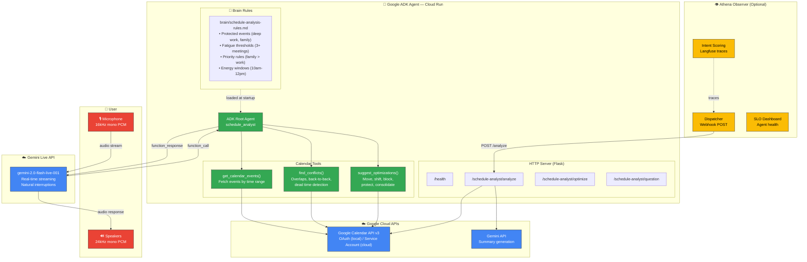
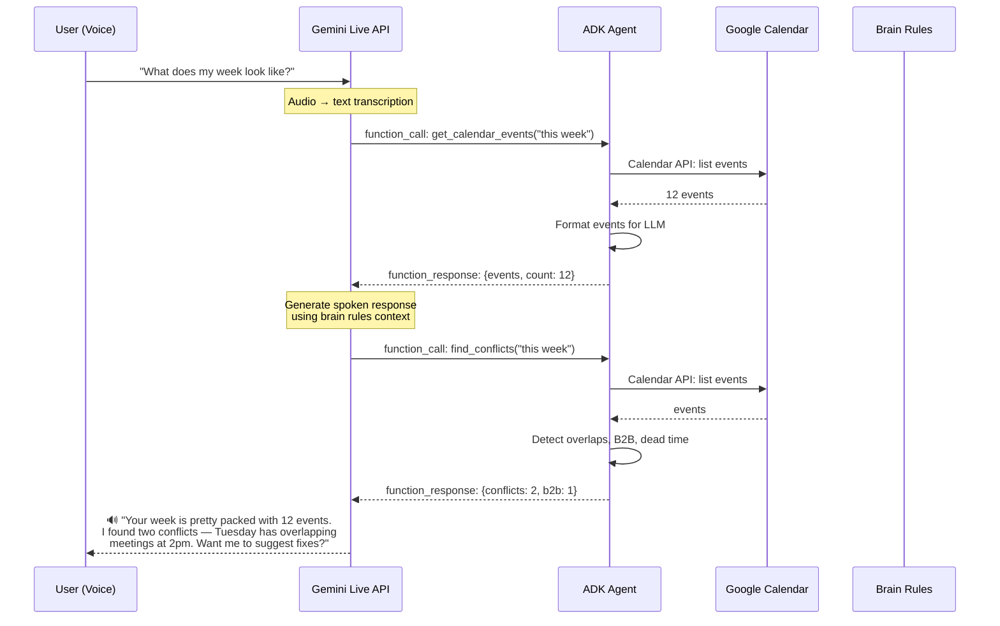
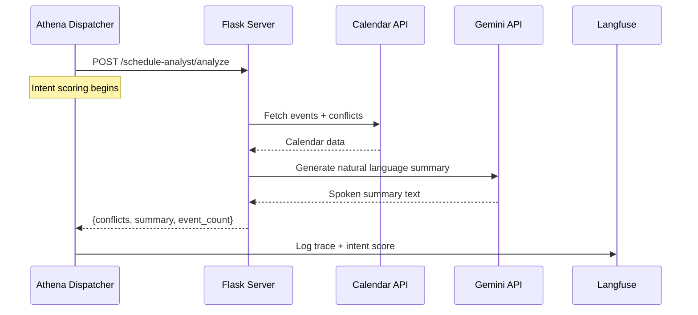
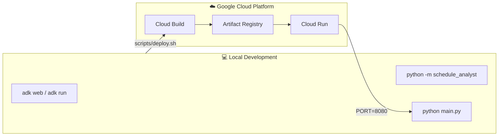

# Architecture — Voice Schedule Analyst

## System Architecture

## Data Flow

### Voice Mode (Competition Demo)

### HTTP Mode (Athena Integration)

## Component Responsibilities

| Component | Role | Technology |
|-----------|------|-----------|
| **Gemini Live API** | Real-time voice ↔ text, streaming, interruptions | `gemini-2.0-flash-live-001` |
| **ADK Root Agent** | Tool orchestration, system instruction, brain rules | `google-adk` |
| **Calendar Tools** | Event fetching, conflict detection, optimization logic | `google-api-python-client` |
| **Brain Rules** | Configurable analysis preferences (markdown) | Human-editable `.md` |
| **Flask Server** | HTTP endpoints for Cloud Run + Athena webhooks | `flask` + `gunicorn` |
| **Athena Observer** | Intent scoring, SLO tracking, Langfuse traces | External (optional) |

## Deployment

